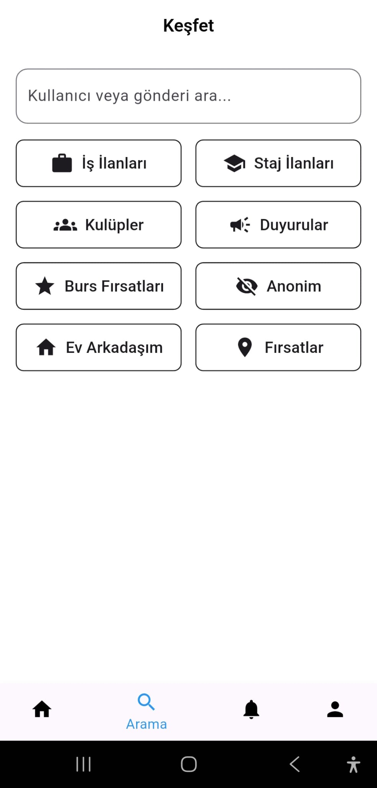
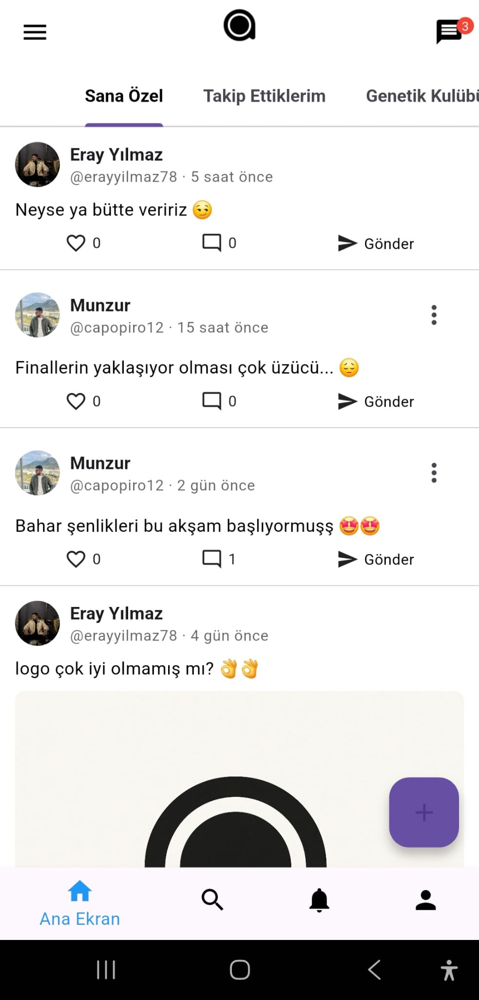
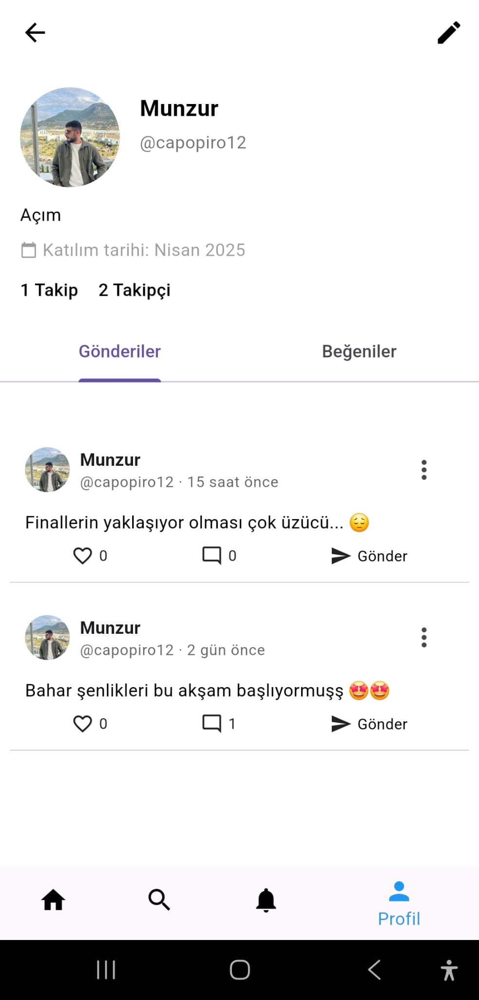
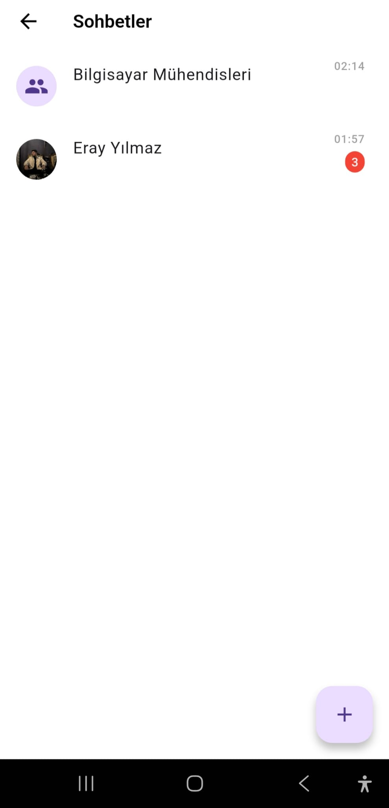
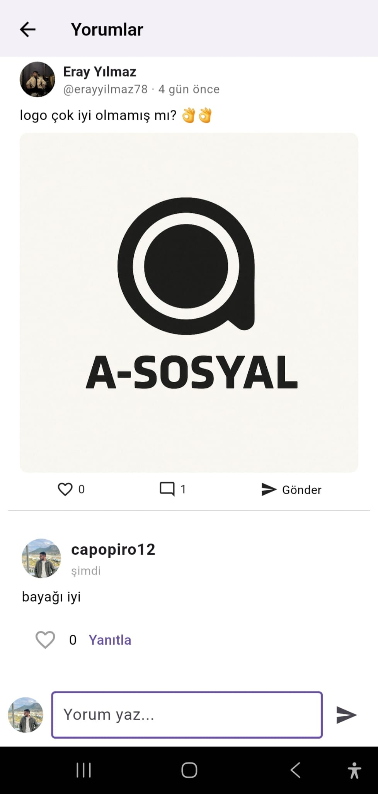
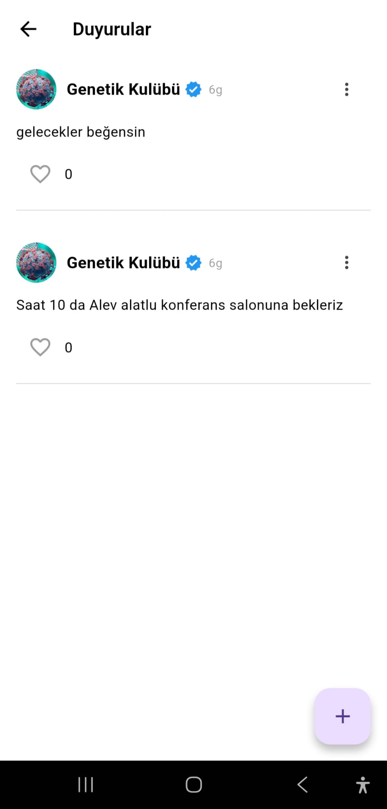
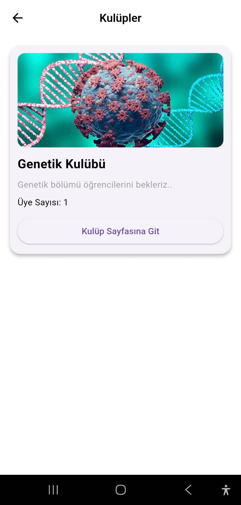
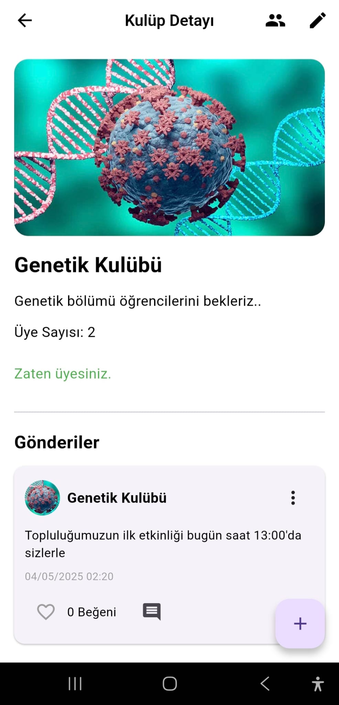

# 📱 Asosyal – Flutter Social Media App (Preview Only)

Welcome to the **preview** of *Asosyal*, a Flutter-based social media mobile app powered by Firebase.

This repository provides **screenshots only** for demonstration purposes.  
> 🔒 Source code is **not** included in this repository.

---

## 🖼️ Screenshots

### 🧭 Discover Page  

### 📰 Feed Page  

### 👤 Profile Page  

### 💬 Message List Page  

### 📝 Comments Page  

### 📢 Announcements Page  

### 🧩 Clubs List Page  

### 🏛️ Club Detail Page  

---

## 📌 App Overview

- Built using **Flutter**
- Backend with **Firebase**
- Real-time messaging, community feed, user profiles
- Modular structure with clean UI components

---

## 👨‍💻 Developers

**Eray Yılmaz**  [LinkedIn](https://www.linkedin.com/in/erayyilmaz78/) [GitHub](https://github.com/erayyilmaz78)
**Muzurcan Doru** -[LinkedIn](https://www.linkedin.com/in/muzurcandoru/) [GitHub](https://github.com/munzurdoru)

---

© 2025 Eray Yılmaz & Muzurcan Doru. All rights reserved.
